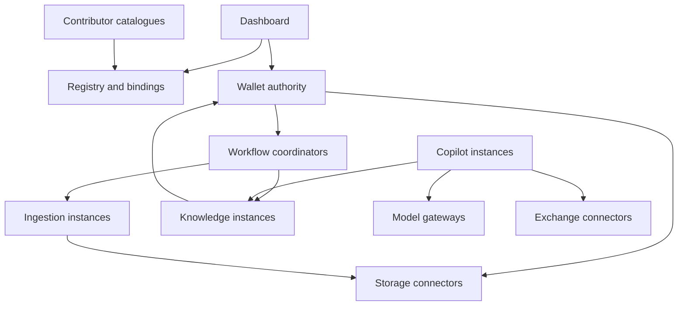

# Architecture baseline

Status: agreed conceptual direction, with implementation proposals explicitly left open.

## Composition model

| Object | Meaning |
| --- | --- |
| Capability | A role such as ingestion or knowledge retrieval |
| Implementation | A contributor's version of that role |
| Offering | A catalogue entry describing an implementation and delivery terms |
| Instance | A running deployment or hosted endpoint |
| Binding | Assignment of an instance to a wallet, collection or workflow |
| Grant | Delegated permission to access resources or perform operations |

An installation is a composition, not a monolithic product. A wallet has one authoritative resource and policy namespace; it may have replicas. Multiple wallets can be presented through one dashboard without becoming one authority.

All connections require authentication and policy enforcement even where those controls are not drawn. Arrows show logical dependencies, not mandatory direct network connections.

## Wallet responsibility

Inventory stable resource identifiers, source location references, source version/hash, provenance, sensitivity, availability and policy references. A move changes a location binding rather than a resource's identity. Updates create identifiable versions. Preserve originals; derived records reference exact input versions and producing instances.

The wallet records decisions and accepted changes. Workers can submit proposed derived records; authority to submit is not authority to overwrite evidence.

## Independent services

Storage connectors mediate physical stores. Ingestion transforms authorised snapshots into derived records. Knowledge services build independently replaceable indexes or graphs. Gateways route model requests. Copilots run constrained tools. Exchange connectors implement source and ecosystem-specific interactions. Coordinators manage durable jobs. The dashboard is a client, not an execution dependency.

Services must not depend on another provider's private database schema. Internal packaging is free as long as the public boundary is preserved. A single process can implement several capabilities and advertise whether they can be deployed separately.

## State and jobs

Each job has an owner/coordinator, correlation identifier, input versions, scoped grant, output destination and expiry. Proposed lifecycle: queued, running, succeeded, failed, cancelled, expired. Cancellation has an acknowledgement and may arrive after output was already produced.

Assume retries and duplicate deliveries. Require idempotency keys for mutations and durable reconciliation; do not assume exactly-once transport. Conflict handling uses expected resource versions rather than last-writer-wins for authoritative evidence.

## Knowledge federation

Several services may index different or overlapping scopes. They return evidence references, versions, freshness and producer identity. Scores from different services need not be comparable. A synthesiser preserves attribution and explicitly resolves contradictions rather than silently merging conclusions.

Permissions are checked before retrieval content is delivered to a model. Index refresh, removal and access changes are independent lifecycle events. Unavailable and stale sources must be visible.

## Provider substitution

Declare API compatibility, semantic compatibility and migration compatibility separately. Index replacement may mean rebuilding from originals. Bindings switch only after readiness checks and a migration plan; old grants are revoked after controlled cutover. Rollback cannot undo exported data.
