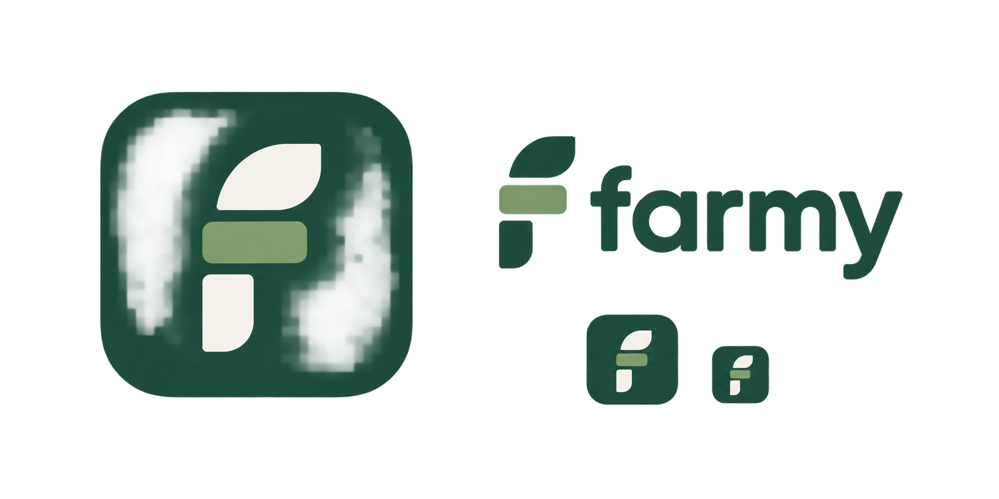

# Farmy visual identity — concept v1

The modular **f** uses forest green (`#194d3c`), sage (`#87a270`) and warm ivory (`#f6f5ef`). Separate pieces form one mark, reflecting independently replaceable components. This is the current concept, not a final or trademark-cleared identity.

`farmy-logo-proposal.png` preserves the original proposal generated with the built-in image-generation tool. `farmy-mark.svg` is a clean vector interpretation for small interface icons; it is not a bitmap crop. It is copied into the public dashboard and packaged workbench so each works independently.

Used in the repository introduction, project dashboard, annotated phone demo and local workbench. The supplied original phone mockup remains unchanged.

Generation brief: a modular lowercase f made from three softly rounded geometric pieces, forest green, sage and ivory; a rounded-square Mac-style app-icon proposal and lowercase farmy wordmark; simple, legible, expressing modularity and ownership without agriculture-only imagery.
