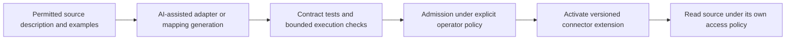
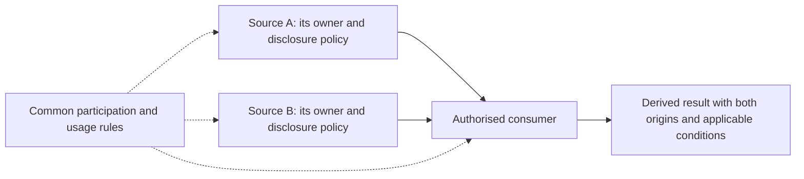
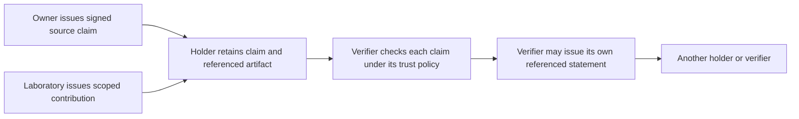

# Three concepts brought together in Farmy

Status: accepted product direction, clarified by the maintainer on 2026-09-21. The six runnable slices establish a narrow local foundation; they do **not** yet implement runtime-generated source interfaces, federated data-space governance or credential trust networks. This document describes where Farmy is going, not additional completed features. See [ADR 0013](decisions/0013-adaptive-federated-trust.md).

Farmy brings together **AI-enabled adaptability**, **independently governed data sources** and **wallet-based networks of trust**. These reinforce one another: AI helps connect a new source; that source retains authority over its disclosure; signed claims make the origin and contributions to its information assessable by other participants. None of these requires all data or all authority to move into a central Farmy installation.

## 1. AI gives modules plasticity

AI is useful for analysing content, extracting facts, generating embeddings and proposing ontologies or mappings. It can also shorten the path from encountering a new source to using it. A specialised module could inspect permitted API descriptions and examples, generate an interface configuration or adapter code, test it and propose its activation.

**Plasticity** means that a module with a suitable extension mechanism can acquire supported behaviour during operation without updating or redeploying its host executable or Farmy as a whole. A new API mapping could become a versioned connector configuration; where configuration is insufficient, a supported isolated extension runtime could admit generated adapter code. The generator may be a separate module or an explicitly declared capability within an implementation. It is not a mandatory tenth family or an unrestricted code executor in the core.

Generation does not grant deployment or data access rights. An already delegated admission policy may allow automatic activation; cases outside that authority require an authorised decision. Preserve the source specification, generated artifact digest/version, producer/model provenance, test results, effective privileges, activation record and rollback target. Keep credentials referenced rather than embedded in generated code. Pin existing jobs to their original extension and binding revisions.

The realistic promise is faster adaptation to sources supported by the available transport, runtime and semantics. It is not guaranteed integration with any source: unavailable documentation, proprietary protocols, incompatible data meaning, missing credentials or a new hardware/runtime dependency may still require engineering and a host-module release. “No host update” does not mean “no versioned change”.

Ownership stays modular: Connectors own source-interface behaviour and credentials; specialised Processing may generate/test artifacts; Assistance may propose an adaptation; Model access governs inference; Registry owns declared extensions/bindings; Workflow coordinates the lifecycle; Wallet governs relevant rights and provenance. An implementation may combine compatible responsibilities while keeping their permissions explicit.

## 2. Decentralised sources participate in common governance

Decentralisation is about **independent authority as well as location**. A source may belong to a farmer, laboratory, cooperative, machinery provider or another participant. Its controlling party determines which consumers may access it, for which purposes and under which disclosure/usage conditions. Placing all services on different machines would not, by itself, create this model.

A data space is the governed relationship between participants: agreed identity and trust rules, vocabulary/contracts, participation conditions, permitted uses, onward-disclosure responsibilities, accountability and dispute/withdrawal procedures. Participants need not share a database, wallet operator or hosting provider. A governance service or shared catalogue may help coordination without taking over source authority.

A transfer must satisfy the source's policy and the applicable common rules; membership alone is not read permission. Combining two sources requires authority from both, and a defined policy for the derived output. Do not silently drop conditions when indexing, transforming, prompting a model or onward-disclosing. For ongoing observations, grants remain scoped to source + owner + consumer; observations needing different rules belong in separate logical or physical sources.

Wallet instances retain their own authority namespaces. Connectors enforce access at the source boundary; Exchange governs external disclosure; receiving participants carry applicable terms and provenance into their own decisions. The data-space arrangement defines whose decisions are required and how participants verify them. No universal central FarmWallet approves all sources.

Farmy can enforce access and transfers through boundaries it controls, record exact release attempts and identify accountable consumers. After usable content is delivered, consumer duties and governance still matter; cryptography cannot guarantee every downstream use or recall an existing copy. A specific external data-space protocol or certification profile has not yet been selected.

## 3. Wallets support networks of signed claims and contributions

FarmWallet combines resource authority with the ability to manage or reference verifiable claims, presentations and trust decisions. Cryptographic operations can be supplied by compatible credential/key-custody adapters or an attached external wallet. The external wallet complements FarmWallet; it does not automatically replace its inventory, policy or provenance responsibilities.

A participant can act as **issuer**, **holder** and **verifier** in different interactions:

- An owner signs a declaration linking a source or exact resource version to an ownership/control claim. This supplies attributable evidence of the declaration and signing-key control. Other supporting evidence and verifier policy determine whether ownership is accepted.
- A laboratory or other contributor signs its own scoped statement: measurement, certification within a stated scope, confirmation, review or marking of a referenced artifact. Its statement identifies what was done, by whom, when, by which method and over which exact evidence.
- A holder retains and selectively presents permitted claims. A verifier checks the binding to the subject/artifact, signature, issuer identity and authority, validity/status and the meaning relevant to the intended use.
- A verifier may subsequently issue a new, separately scoped statement referencing earlier claims. That statement can be presented to a different third party, building a chain or graph of contributions without rewriting the original.

This is a **network of evidence and explicit trust decisions**, not automatic transitive trust. Trusting an adviser does not automatically make every upstream issuer trustworthy. Preserve each issuer, claim scope, artifact/version digest, evidence links, validity/status and verification result. Contradictory claims may coexist; they need assessment rather than silent merging.

A valid signature does not make an assertion true, establish legal title by itself, turn AI output into a certified fact or grant access to the signed data. A verifier can reject a cryptographically valid claim. Ownership, contribution, consent and read/export permission remain distinct semantics. Presenting credentials is itself a disclosure subject to the holder's and applicable source policies.

Wallet owns claim references, trust-policy decisions and accepted provenance; credential adapters own format/signing/presentation integration and key custody; Exchange handles authorised outward presentation; Knowledge may index permitted claim relationships without becoming their authority. No ledger/blockchain, particular wallet vendor, cryptographic suite or credential standard is mandated by this vision. Concrete interoperability and recovery profiles require a later tested slice.

## Current evidence and next demonstrations

| Concept | What runs today | What would demonstrate the broader concept |
| --- | --- | --- |
| AI-enabled plasticity | UC-004 uses one explicitly selected local model with validated output; connectors remain hand-written | Add a new synthetic source mapping through an admitted extension, preserve old jobs and roll back without redeploying the host |
| Source-governed data spaces | UC-003 implements source/owner/consumer grants in one local authority; UC-005 observes independent service boundaries | Two independently controlled sources/wallets enforce distinct conditions under one declared participation agreement; a denied combination discloses nothing |
| Wallet trust networks | Exact provenance, permission enforcement and service authentication; no owner/contributor credential issuance or presentations | Owner and independent contributor sign scoped claims; a holder presents them; two verifiers apply explicit trust policies, including invalid/revoked or unacceptable claims |

These are architectural acceptance directions, not a silent expansion of the active [delivery queue](delivery-backlog.md). Existing slices remain the regression baseline. The next implementation still needs one concrete use case, a bounded trust model and explicit success/denial/recovery evidence.
