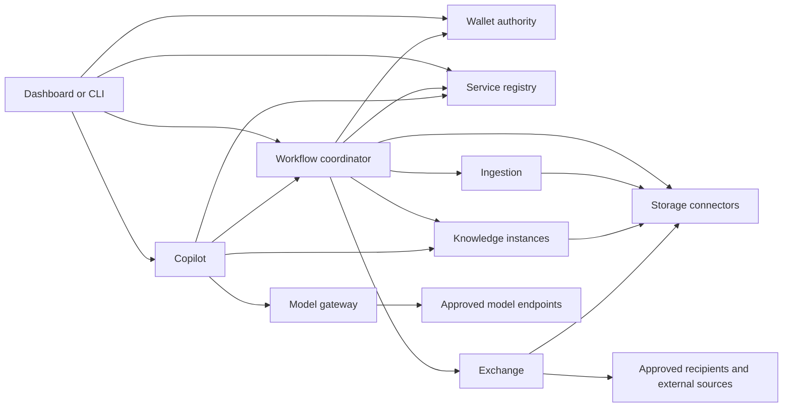

# Capability, module and technical architecture

Status: consolidated review draft. Existing architectural principles and the Python/HTTP/JSON/local SQLite reference stack are accepted; the nine-family grouping is the agreed reference baseline, while core composition and detailed implementation choices remain proposals, not implemented behaviour.

Read this before deployment design. The sequence is capability ownership, module boundaries, communication/security, module implementation, then environment-specific packaging. See [ADR 0006](decisions/0006-architecture-first.md).

## Meaning of module

A capability is a function. A module is a replaceable software boundary implementing one or more capabilities through public contracts. An implementation is a contributor's realisation of a module; an instance is a running copy. A package can bundle modules, but neither bundling nor being on the same machine removes their authorisation or ownership boundaries. This map does not require one process per capability.

Bindings select instances; grants authorise actions. An offering advertises a provider's implementation or hosted service and is not itself an instance, binding or grant.

## Review of abstract coverage

The [capability review](capability-review.md) expands the document-oriented map to source/event acquisition, general processing, model execution and controlled actions, with clear ownership of approvals and data lifecycle. These additions are proposals, not extra first-release deliverables. The [integration profile](module-integration.md) defines what independent modules must declare and prove.

## Reference grouping: nine service module families

The broad capability catalogue is not a deployment inventory. Group implementations by cohesive responsibility, owned state, privilege boundary and independent change. The following nine families cover the first document solution; they are the agreed reference grouping, not nine mandatory servers or a limit on future modules. A family defines contracts, not a central service hosting every implementation.

| Module family | Capabilities grouped | Owned state / reason to group | Must stay outside |
| --- | --- | --- | --- |
| FarmWallet | Resource/collection identity, version and provenance acceptance, policy/grants, retention decisions | Authoritative resource and policy state; consistent acceptance and authorisation | Parsers, indexes, provider SDKs, workflow execution and domain algorithms |
| Service registry | Implementation/instance discovery, compatibility declarations, configuration references and bindings | Installation composition and binding revisions | Farm grants, executing jobs, silently trusting catalogue entries |
| Workflow coordinator | Durable jobs, step ordering, triggers, approvals-in-progress, retries/cancellation and reconciliation | Workflow state and pinned inputs/bindings; one coordinator per job | Domain algorithms, identity issuance, grant approval and provider-specific branches |
| Connectors | Physical storage access and source acquisition, grouped by external system and credential boundary | Provider credentials by reference, source cursors, location/version mapping and staged-copy records | Parsing, analytics, answering questions or deciding export permission |
| Processing | Ingestion, extraction, normalisation, validation, calculation, transformation and rendering as declared specialisations | One implementation owns its algorithm/configuration and proposed results; operations share versioned inputs/provenance and job semantics | Authoritative commits, retrieval index ownership, unapproved external effects |
| Knowledge | Indexing, retrieval, graph/query access, freshness and index removal | Derived indexes and exact source/version references | Wallet authority, raw source credentials or domain workflow orchestration |
| Model access | Model profiles, provider adapters, parameter validation, approved routing and egress control | Endpoint/secret references and minimal invocation state | Owning every model runtime, task reasoning or tool permissions |
| Assistance | Copilot/task reasoning, evidence synthesis, citation validation and constrained tool proposals | Scoped conversation/task state and answer dependencies | Owning durable external workflows or executing effects without boundary checks |
| Exchange | Disclosure preparation, exact-content/recipient approval binding, delivery and receipts | Disclosure manifests and external delivery outcomes | General computation, ordinary source acquisition, equipment control or new permissions |

Connector implementations are scoped, such as Local Folder, S3 or a later weather API. Do not build a universal connector daemon with every credential. Processing implementations are scoped, such as Document Extraction or a later calculation module. Do not build a universal processor with every algorithm. Several independently deployed instances and implementations of either family may coexist.

For this grouping, the earlier Ingestion role is a specialised Processing module, Source acquisition belongs to the Connector family, and the earlier Model gateway is the Model access module. These are architecture terms; published API names do not exist yet. Source acquisition must still satisfy Exchange/disclosure controls whenever a request sends private information to an external party.

### Supporting components and future boundaries

- Identity/trust infrastructure is an independently replaceable dependency, integrated through agreed profiles; Farmy should not build an identity product for the MVP.
- Audit recording/enforcement belongs in every producer. A separately deployable collector is optional initially; no shared audit database becomes a private integration dependency.
- Dashboard/CLI/external clients sit outside background service ownership. A client can compose workflows without a copilot.
- Model runtimes are independently supplied dependencies behind Model access. Installing a model runtime is not the same as installing routing policy.
- Catalogues advertise offerings; Registry records selected instances. Deployment administration remains a later separate control boundary.
- Physical actions and credential issuance require specialised later modules with their own trust/safety contracts. Do not place them in Processing or Exchange merely to avoid adding a module.

## Why these boundaries

Keep together operations needing the same owner, lifecycle and local consistency. Split when privileges, state ownership, scale, third-party dependencies, failure containment or independent replacement provide a concrete benefit. A new API endpoint alone is not a reason for a new module.

Wallet, Registry and Coordinator may be delivered in one core distribution for convenience, but retain public interfaces, owned persistence and independently runnable components. Registry changes, long-running jobs and wallet policy are different reasons for change; do not fuse them into a single private schema. Resource-policy consistency belongs inside Wallet, while cross-service updates use revisions, recorded intent and reconciliation rather than one shared transaction.

Ingestion and analytics can share a Processing job envelope without pretending their semantics are interchangeable. An extraction result and a simulation result have different schema identifiers, features and conformance tests. Processing cannot accept arbitrary executable code from a workflow or retrieved document; a new implementation is explicitly registered and trusted.

Prefer a small common resource/provenance envelope with versioned capability-specific payloads. Wallet can preserve validated references to new payload types without acquiring every domain schema, but must reject unknown security semantics. A module must declare schema ownership, features and input/output meaning; an unrestricted JSON blob or universal `execute(anything)` endpoint would conceal coupling rather than remove it.

## Extension and change rules

Existing-capability extension: change or introduce the implementing module, its descriptor/configuration and a solution binding/workflow. Other modules should require no source change if the established contract and semantics cover the extension. Changes to configuration, schemas, credentials and migration are still real work and must be recorded.

New-capability extension: design its contract and authority semantics explicitly; affected callers, UI or policies may need updates. Do not claim all future capabilities can be implemented by configuration alone. Changes that cross several modules need a reason, not an automatic prohibition.

Shared code is optional, limited to transport, validation and security primitives. Keep domain business rules and private models out of a compulsory common package. A contribution must not require coordinated deployment of all modules merely because they share a repository.

## Modularity change scenarios

These are planned architectural acceptance tests, not executed results. For each MVP increment, record source changes, configuration/contract changes, state migrations and which other modules stayed on their existing versions.

| Extension | Expected implementation change | Other changes / limits |
| --- | --- | --- |
| Add another S3-compatible store supporting the existing features | Connector configuration only, or connector adapter if provider behaviour differs | Credentials, bindings and actual compatibility tests; do not assume every S3-like API matches |
| Add a new document format | Document Processing parser/implementation | Advertise supported input/result schemas; Wallet, Registry and Knowledge stay unchanged if the evidence contract still fits |
| Add a new calculation over known structured data | New specialised Processing implementation | New operation/output schema and workflow binding; a specialised UI may need work, generic status/result handling should not |
| Replace keyword search with another conforming provider | Knowledge implementation | Rebuild/migrate index, compare semantics, change binding/revoke old grants; no Wallet schema access |
| Add a model provider | Model access adapter or compatible external endpoint configuration | Model profile, secrets and egress approval; Copilot unchanged only if advertised features match |
| Add a report recipient protocol | Exchange delivery adapter | Recipient policy, credentials, receipt/retry semantics; Processing and Knowledge should not change |
| Add a new use case using existing capabilities | Versioned solution workflow, bindings and grants | UI/presentation may change; Coordinator engine must not gain domain-specific branches |
| Add live sensor streams | New Connector specialisation and stream contract; possibly specialised Processing/Knowledge | Flow control, time windows and retention are new semantics: intentionally outside the document MVP |
| Add physical actuation | New Action implementation and safety/authorisation contract | Coordinator, policy and UI changes may be necessary; not a generic processing extension |

Repeated co-changes are evidence to revisit a boundary. If provider additions repeatedly edit Wallet or Coordinator, domain detail is leaking into the core. If one module accumulates unrelated credentials, dependencies, operators and failure modes, split it. If two modules are always changed together and need synchronous back-and-forth for every operation, review whether they should be one module or use a better contract. Security/trust boundaries can justify separation even when that costs performance.

Contributor guidance is organised by family in [modules](../modules/README.md), with [solution recipes](../solutions/README.md) and separate [deployment profiles](../deployments/README.md). All are design-only until executable artifacts and tests exist.

## Proposed core and first solution

**Minimal core:** Wallet authority, service registry and durable audit recording, using an identity/trust integration. These functions give the installation authority and composition; a separate audit collector is optional initially. A configured storage connector makes the core useful with real resources. This is a proposed composition, not a new requirement that all modules run together.

**First document solution:** core plus Local Folder and S3 Connector implementations, Coordinator, a Document Processing implementation, Knowledge, Model access, Assistance and Exchange for controlled export. The dashboard is replaceable by a CLI; neither must remain open. Two knowledge instances and a separately implemented alternative prove multiplicity and substitution after the basic path works.

The identity system can be locally operated or external. It need not be a Farmy-written identity product. Deployment tooling and a public marketplace are not prerequisites for the document path.

## Dependency map

Arrows show request direction, not deployment location. Every protected module also depends on Wallet policy decisions and authenticated caller identity. Every producer owns a durable audit outbox; it may forward to an audit collector. These cross-cutting edges are omitted for readability.

A worker only reads through Storage when the grant permits that exact transfer; the graph is not an allowlist by itself. Knowledge reads accepted derived artifacts through a connector, not Ingestion's private database. No downstream call inherits the caller's entire credentials.

## Technical reference implementation by responsibility

The rows below describe responsibility-level components, not an additional module count; apply the nine-family grouping above. Python services, HTTP/JSON APIs, OpenAPI/JSON Schema and service-owned local SQLite follow ADR 0002. Exact libraries and versions are selected after contract review. The choices below are proposed internals; contributors can replace them without reproducing private schemas. SQLite alone supplies no encryption or high-availability guarantee: private-data operation requires an explicit storage/key design.

| Module | First implementation structure and persistence | Critical verification |
| --- | --- | --- |
| Wallet | API layer, policy evaluator and repository layer; transactions for resource/version registration, accepted derivations and audit outbox. Stable opaque resource IDs separate from immutable version records, content digests and location references. Expected-version checks on changes. | Move preserves identity; content change creates a version; stale writes and cross-wallet access denied; untrusted derivation cannot become authoritative by itself |
| Registry | API plus local tables for implementations, instances, trust references and binding revisions. Compare declared contracts/features; pin a binding revision per job. Validate endpoint configuration under restricted administration. | Binding changes confer no grants; incompatible or untrusted endpoint rejected; running job does not silently switch provider |
| Coordinator | Persistent state machine with step table, retry schedule, owner lease/fencing and scoped idempotency records. One active owner; recovery resumes from durable state. Poll worker jobs initially; no mandatory message broker. | Duplicate deliveries yield one accepted result; abandoned lease recovery; cancelled or expired work is not accepted silently |
| Storage | Shared connector contract with separate local-folder and S3 implementations. Resolve wallet references to approved roots/buckets, use version-aware reads, hash/snapshot mutable local files, stream bounded bytes. Provider credentials stay inside the connector. | Path traversal/symlink escape denied; mutable source detected; S3 version semantics verified; unauthorised or expired read denied |
| Ingestion | API/worker split internally; parser adapters with bounded CPU, memory, time and input size. Start with synthetic plain text, then isolated PDF extraction. Write proposed artifacts to an authorised output connector and return hashes, extraction version and provenance. | Malformed/parser-hostile input contained; no parser network/tools by default; output schema and limits enforced; input version traceable |
| Knowledge | API plus indexing worker; first implementation uses deterministic text search, with its own local full-text index and source/version/chunk mapping. Later vector/graph implementations expose the same evidence contract with declared semantics. | Permission-filtered evidence, stale/missing versions signalled, deletion propagated, index rebuild works, scores not treated as comparable across providers |
| Model gateway | Provider adapters behind validated model profiles; bounded requests/streams, explicit destination/data-category policy, secret resolver, timeout/cancellation and usage records. No private prompt logging by default. | Unsupported parameters rejected; forbidden fallback blocked; invocation cannot smuggle unapproved sources or tools |
| Copilot | Explicit query/retrieve/synthesise state machine, evidence set, citation validator and constrained tool dispatcher. Durable long-running actions submitted to Coordinator; session storage belongs to Copilot and is access-controlled. | Unsupported citations rejected or marked; document instructions cannot cause tool access; model output cannot extend grants; revoked conversation evidence not reused unchecked |
| Exchange | Prepare an immutable disclosure manifest and preview, then deliver exact authorised bytes to the named recipient. Local file export first; remote adapters later. Track attempt IDs, checksums and acknowledgement uncertainty. | Separate export permission; preview/approval bound to content, recipient and purpose; no blind duplicate delivery after an ambiguous result |
| Audit | Each service writes events with its local mutation/outbox transaction where possible; collector uses producer/event IDs for deduplication and restricted querying. Payload minimisation and retention are explicit. | Collector outage preserves pending events; failure to record required audit stops protected action; no tokens or raw source text in ordinary logs |
| Dashboard / CLI | Thin typed clients generated or checked against contracts; show versions, provenance, pending jobs and destination approvals. CLI first is sufficient; UI framework remains open. | Closing client does not stop jobs; hidden UI controls are never the authorisation mechanism |
| Identity integration | Adapter validates issuer, subject, expiry and intended audience through established libraries; separate service identity bootstrap and rotation interface. Maintain trusted-issuer mappings, not bespoke password or cryptographic protocols. | Unknown issuer, wrong audience, expired credentials and revoked instance rejected; possession of identity alone grants no farm access |
| Deployment controller | Deferred implementation; later consumes release manifests and acts via target-specific adapters. It accesses health/registration contracts and records instance identity, not private module databases. | Cannot create data grants or run with unbounded infrastructure privileges implicitly |

These are per-module technical designs, not selected frameworks or runnable components. Each implementation needs a configuration schema, private persistence schema/migrations, credential handling, failure limits and contract tests before its first release.

Additional Source acquisition and Processing specialisations, Model runtimes and future Action modules still need implementation designs after their contracts are reviewed. Their appearance in the map does not silently select a framework or add them to the first document release.

## Shared data boundaries

Wallet owns resource identity/version, policy/grant and accepted provenance schemas. Registry owns binding revisions and instance references. Coordinator owns jobs/steps. Knowledge owns evidence envelopes referencing exact Wallet versions, producer identity and freshness. Exchange owns disclosure receipts. Each module owns its events and errors under a shared envelope. Originals and derived artifact bytes live behind storage connectors; neither a model answer nor a search index replaces the original evidence.

A multi-source derived record or answer must retain the contributing source set. Access is conservatively bounded by that source set unless an explicit, reviewed declassification/transformation policy says otherwise. Copies in prompts, caches, histories and exports remain part of the security design.

## Proposed MVP cases to test the grouping

Use synthetic records and progressively add boundaries rather than implementing every service before producing a useful result.

1. **Controlled memory:** register a synthetic soil report from a local folder, inspect its exact version, relocate it without changing its resource ID, and deny an unauthorised reader. Exercise Wallet, Registry and a Connector through a thin client with identity and durable audit.
2. **Useful evidence:** extract a known field from the report and retrieve it with the exact source/version reference; repeat the ingestion request and verify one accepted result. Add Coordinator, Document Processing and Knowledge. No LLM is needed for this test.
3. **Assisted answer and disclosure:** answer a question from authorised evidence using an explicitly selected model, preview an export and deliver only after export authorisation. Add Model access, Assistance and Exchange. Add S3 via a second Connector and verify the earlier path still works.
4. **Prove modular benefit:** replace a Processing or Knowledge implementation through declared binding/migration, run two Knowledge instances, and repeat the earlier cases while unaffected modules remain unchanged. Use a separately implemented provider, not just another configuration of the same one.

These are proposed test cases, not a claim of agronomic accuracy or deployed functionality. An initial implementation may use fixed reviewed workflows; a general-purpose visual workflow editor is not needed. Security checks are introduced with each affected boundary, not postponed until the last case. Offline cloud execution and OS/cloud packaging remain later acceptance work.

## What to review next

1. Review the nine-family grouping and minimal core against the change scenarios; the grouping is the reference baseline and should evolve with measured MVP evidence.
2. Review the exact document/query/export sequences and security proposal in [module communication](module-communication.md).
3. Record accepted security decisions for service identity, grants, keys and offline execution; then turn the contracts into schemas and conformance fixtures.
4. Implement the smallest working path, verify boundaries and substitution, then create independent packages for macOS, Windows, Linux and Kubernetes.

Scaleway remains the chosen first cloud provider. Its project, region, sizing and landing-zone implementation are deferred until the architecture and module needs justify those choices.
