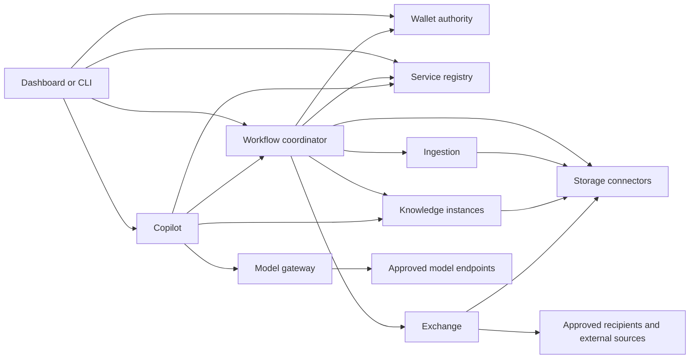

# Capability, module and technical architecture

Status: consolidated review draft. Existing architectural principles and the Python/HTTP/JSON/local SQLite reference stack are accepted; the module grouping, core composition and detailed implementation choices below are proposals, not implemented behaviour.

Read this before deployment design. The sequence is capability ownership, module boundaries, communication/security, module implementation, then environment-specific packaging. See [ADR 0006](decisions/0006-architecture-first.md).

## Meaning of module

A capability is a function. A module is a replaceable software boundary implementing one or more capabilities through public contracts. An implementation is a contributor's realisation of a module; an instance is a running copy. A package can bundle modules, but neither bundling nor being on the same machine removes their authorisation or ownership boundaries. This map does not require one process per capability.

Bindings select instances; grants authorise actions. An offering advertises a provider's implementation or hosted service and is not itself an instance, binding or grant.

## Review of abstract coverage

The [capability review](capability-review.md) expands the document-oriented map to source/event acquisition, general processing, model execution and controlled actions, with clear ownership of approvals and data lifecycle. These additions are proposals, not extra first-release deliverables. The [integration profile](module-integration.md) defines what independent modules must declare and prove.

## Capability ownership map

Names below are descriptive working names, not product or package commitments.

| Module | Capabilities owned | State owned | Explicit boundary |
| --- | --- | --- | --- |
| FarmWallet authority | Resource/collection identity, version inventory, provenance acceptance, policy decisions, issuing/revoking grants | Authoritative resource metadata, locations, policies, grants and accepted derivations | Does not own all source bytes, execute parsers or maintain search indexes |
| Service registry | Implementation/instance discovery, endpoint and contract records, scoped bindings and compatibility checks | Trusted instance registrations, bindings and configuration references | Discovery and bindings never grant farm-data access; public catalogues are separate inputs |
| Workflow coordinator | Durable ingestion/indexing/export workflows, retries, cancellation and reconciliation | Job ownership, pinned inputs/bindings, step status and idempotency records | Exactly one coordinator owns each job; it cannot approve its own extra permissions |
| Storage connector | Inventory, read exact versions, optional write/delete, source change detection and controlled staging | Provider credentials by reference, source cursors, object/location mappings and temporary-copy records | Multiple implementations: local folder, S3, later Drive/synchronised folders; no content interpretation |
| Source adapters | Acquire structured records, batches, events and external changes | Source credentials by reference, cursors and delivery/deduplication state | Distinct from storage and parsing; may initially share an Exchange implementation |
| Processing | Transform, validate, aggregate, calculate and render proposed outputs | Algorithm/configuration references, job results and input provenance | No automatic authority to commit or disclose transformed results |
| Ingestion | Parse/extract, normalise, chunk and propose derived records | Attempt status, temporary authorised snapshots and result references | Cannot overwrite originals or make proposed results authoritative |
| Knowledge | Index/remove authorised versions, retrieve evidence and report freshness | Derived indexes, source/version references, index job state and permissions metadata | Indexes are rebuildable; cannot invent authoritative facts or permissions |
| Model runtime / adapter | Execute model inference | Model/version artifacts or external-provider references, execution state | Separate from routing policy; may be external and accessed through the gateway |
| Model gateway | Model profiles, parameter validation, approved routing, invocation and usage accounting | Profiles, endpoint/secret references and minimal invocation metadata | Does not own chat reasoning or issue tool permissions; local failure cannot select an unapproved cloud model |
| Copilot | Query interpretation, evidence synthesis, controlled tool proposals and source-linked answers | Scoped task/conversation state, evidence references and answer provenance | Uses Knowledge and Model APIs; cannot bypass grants by following document or model instructions |
| Exchange | Prepare disclosures, authorised delivery, external-source import and ecosystem-specific adapters | Disclosure manifests, recipient/purpose records and delivery acknowledgements | Read permission is insufficient to export; signatures do not turn inference into official certification |
| Action/tool adapters | Execute authorised external commands or writes | Command identity, execution attempts and outcome receipts | Separate from Copilot reasoning; physical actions need a later safety profile |
| Audit collector | Receive, deduplicate and query security/operational events | Collected event records, retention and access policies | Each producer must durably record locally first; collector unavailability must not erase events |
| Dashboard / CLI | User interaction, viewing sources/jobs, requesting bindings/grants, reviewing exports | Minimal client preferences and session state | No authoritative policy, source store or durable background execution |
| Identity/trust integration | Human/service authentication, trusted issuer mapping, credential lifecycle | Identity provider state and service trust material under their respective owners | Integrate established identity infrastructure; authentication is separate from wallet authorisation |
| Deployment controller (later) | Install/upgrade/retire instances and report actual deployment state | Deployment plans, artifact versions and infrastructure references | Privileged infrastructure actions do not confer farm-data grants |

External catalogues supply offerings to the registry after validation. Weather, market and scientific inputs use Exchange adapters with source identity, retrieval time, licence and trust metadata; private farm context may only be sent with explicit permission. Agriculture-specific modules implement declared acquisition, ingestion, processing, knowledge, model, copilot, action or exchange contracts; propose a new capability only when those do not express the real boundary. Sensors, equipment actuation and production credentials remain later capabilities requiring their own safety and trust contracts.

## Proposed core and first solution

**Minimal core:** Wallet authority, service registry and durable audit recording, using an identity/trust integration. These functions give the installation authority and composition; a separate audit collector is optional initially. A configured storage connector makes the core useful with real resources. This is a proposed composition, not a new requirement that all modules run together.

**First document solution:** core plus Local Folder and S3 connectors, coordinator, ingestion, knowledge, model gateway, copilot and controlled export. The dashboard is replaceable by a CLI; neither must remain open. Two knowledge instances and a separately implemented alternative prove multiplicity and substitution after the basic path works.

The identity system can be locally operated or external. It need not be a Farmy-written identity product. Deployment tooling and a public marketplace are not prerequisites for the document path.

## Dependency map

Arrows show request direction, not deployment location. Every protected module also depends on Wallet policy decisions and authenticated caller identity. Every producer owns a durable audit outbox; it may forward to an audit collector. These cross-cutting edges are omitted for readability.

A worker only reads through Storage when the grant permits that exact transfer; the graph is not an allowlist by itself. Knowledge reads accepted derived artifacts through a connector, not Ingestion's private database. No downstream call inherits the caller's entire credentials.

## Technical reference implementation by module

Python services, HTTP/JSON APIs, OpenAPI/JSON Schema and service-owned local SQLite follow ADR 0002. Exact libraries and versions are selected after contract review. The choices below are proposed internals; contributors can replace them without reproducing private schemas. SQLite alone supplies no encryption or high-availability guarantee: private-data operation requires an explicit storage/key design.

| Module | First implementation structure and persistence | Critical verification |
| --- | --- | --- |
| Wallet | API layer, policy evaluator and repository layer; transactions for resource/version registration, accepted derivations and audit outbox. Stable opaque resource IDs separate from immutable version records, content digests and location references. Expected-version checks on changes. | Move preserves identity; content change creates a version; stale writes and cross-wallet access denied; untrusted derivation cannot become authoritative by itself |
| Registry | API plus local tables for implementations, instances, trust references and binding revisions. Compare declared contracts/features; pin a binding revision per job. Validate endpoint configuration under restricted administration. | Binding changes confer no grants; incompatible or untrusted endpoint rejected; running job does not silently switch provider |
| Coordinator | Persistent state machine with step table, retry schedule, owner lease/fencing and scoped idempotency records. One active owner; recovery resumes from durable state. Poll worker jobs initially; no mandatory message broker. | Duplicate deliveries yield one accepted result; abandoned lease recovery; cancelled or expired work is not accepted silently |
| Storage | Shared connector contract with separate local-folder and S3 implementations. Resolve wallet references to approved roots/buckets, use version-aware reads, hash/snapshot mutable local files, stream bounded bytes. Provider credentials stay inside the connector. | Path traversal/symlink escape denied; mutable source detected; S3 version semantics verified; unauthorised or expired read denied |
| Ingestion | API/worker split internally; parser adapters with bounded CPU, memory, time and input size. Start with synthetic plain text, then isolated PDF extraction. Write proposed artifacts to an authorised output connector and return hashes, extraction version and provenance. | Malformed/parser-hostile input contained; no parser network/tools by default; output schema and limits enforced; input version traceable |
| Knowledge | API plus indexing worker; first implementation uses deterministic text search, with its own local full-text index and source/version/chunk mapping. Later vector/graph implementations expose the same evidence contract with declared semantics. | Permission-filtered evidence, stale/missing versions signalled, deletion propagated, index rebuild works, scores not treated as comparable across providers |
| Model gateway | Provider adapters behind validated model profiles; bounded requests/streams, explicit destination/data-category policy, secret resolver, timeout/cancellation and usage records. No private prompt logging by default. | Unsupported parameters rejected; forbidden fallback blocked; invocation cannot smuggle unapproved sources or tools |
| Copilot | Explicit query/retrieve/synthesise state machine, evidence set, citation validator and constrained tool dispatcher. Durable long-running actions submitted to Coordinator; session storage belongs to Copilot and is access-controlled. | Unsupported citations rejected or marked; document instructions cannot cause tool access; model output cannot extend grants; revoked conversation evidence not reused unchecked |
| Exchange | Prepare an immutable disclosure manifest and preview, then deliver exact authorised bytes to the named recipient. Local file export first; remote adapters later. Track attempt IDs, checksums and acknowledgement uncertainty. | Separate export permission; preview/approval bound to content, recipient and purpose; no blind duplicate delivery after an ambiguous result |
| Audit | Each service writes events with its local mutation/outbox transaction where possible; collector uses producer/event IDs for deduplication and restricted querying. Payload minimisation and retention are explicit. | Collector outage preserves pending events; failure to record required audit stops protected action; no tokens or raw source text in ordinary logs |
| Dashboard / CLI | Thin typed clients generated or checked against contracts; show versions, provenance, pending jobs and destination approvals. CLI first is sufficient; UI framework remains open. | Closing client does not stop jobs; hidden UI controls are never the authorisation mechanism |
| Identity integration | Adapter validates issuer, subject, expiry and intended audience through established libraries; separate service identity bootstrap and rotation interface. Maintain trusted-issuer mappings, not bespoke password or cryptographic protocols. | Unknown issuer, wrong audience, expired credentials and revoked instance rejected; possession of identity alone grants no farm access |
| Deployment controller | Deferred implementation; later consumes release manifests and acts via target-specific adapters. It accesses health/registration contracts and records instance identity, not private module databases. | Cannot create data grants or run with unbounded infrastructure privileges implicitly |

These are per-module technical designs, not selected frameworks or runnable components. Each implementation needs a configuration schema, private persistence schema/migrations, credential handling, failure limits and contract tests before its first release.

The newly explicit Source, Processing, Model runtime and Action boundaries in the capability review still need implementation designs after their contracts are reviewed. Their appearance in the map does not silently select a framework or add them to the first document release.

## Shared data boundaries

Wallet owns resource identity/version, policy/grant and accepted provenance schemas. Registry owns binding revisions and instance references. Coordinator owns jobs/steps. Knowledge owns evidence envelopes referencing exact Wallet versions, producer identity and freshness. Exchange owns disclosure receipts. Each module owns its events and errors under a shared envelope. Originals and derived artifact bytes live behind storage connectors; neither a model answer nor a search index replaces the original evidence.

A multi-source derived record or answer must retain the contributing source set. Access is conservatively bounded by that source set unless an explicit, reviewed declassification/transformation policy says otherwise. Copies in prompts, caches, histories and exports remain part of the security design.

## What to review next

1. Confirm capability ownership and the proposed minimal core; resolve any overlapping responsibilities.
2. Review the exact document/query/export sequences and security proposal in [module communication](module-communication.md).
3. Record accepted security decisions for service identity, grants, keys and offline execution; then turn the contracts into schemas and conformance fixtures.
4. Implement the smallest working path, verify boundaries and substitution, then create independent packages for macOS, Windows, Linux and Kubernetes.

Scaleway remains the chosen first cloud provider. Its project, region, sizing and landing-zone implementation are deferred until the architecture and module needs justify those choices.
