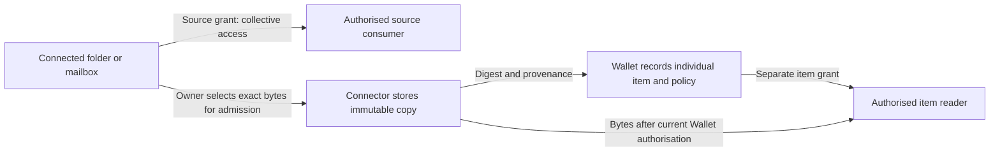

# Connected sources and Wallet-managed items

Accepted distinction, 2026-09-25. [UC-009](../solutions/managed-items/uc009/README.md) demonstrates a narrow local implementation.

**Wallet membership is logical; storage location is a separate choice.** A folder on the same phone or laptop can remain outside the Wallet. A managed item's bytes can live in a Connector's store while its identity, metadata and disclosure policy belong to the Wallet.

| Aspect | Connected source, outside the Wallet | Wallet-managed item |
| --- | --- | --- |
| Unit of permission | Source + owner + consumer | Exact resource/version + consumer |
| Example | A configured folder or mailbox | One admitted document or selected email |
| Visibility | Grant covers the configured source collectively | Grant covers only the individually governed item |
| Metadata | Source identity and ownership | Source provenance, version digest, title, classification and reader ceiling |
| Storage | May be local or remote | May also be local or remote; physical proximity does not define membership |

A folder grant authorises eligible contents inside that configured root, including future contents; it does not expose the whole device. Split differently governed contents into separate sources. Individual rules become applicable after explicit admission into the Wallet; this does not introduce per-observation permissions for sensor sources.

Admission must have authority to retain and use a copy, not merely authority to read. UC-009 deliberately admits only from a synthetic owner-controlled folder, through the owner identity and a current source grant. An operator-configured inherited reader ceiling limits the item's permitted readers; the owner may narrow that list. `private` means owner-only; `restricted` means the explicit allowed list. These labels enforce reader membership, not encryption or certification. Neither list itself issues a read grant.

Source-grant revocation stops subsequent source access and new admissions using that grant. It does **not** recall an already authorised retained copy. Item-grant revocation stops subsequent reads of that copy through Farmy. Originals remain accessible according to their own source and operating-system controls. Downloaded bytes cannot be recalled.

## Implemented scope and limits

UC-009 uses a flat folder of synthetic `.eml` exports: source list/read, owner-only admission, individual grants, immutable content and provenance, restart and fail-closed checks. Metadata lives in Wallet SQLite; bytes and source-release audit live in Connector state. Services communicate through authenticated HTTPS, not shared databases. The monitor reports counts without email names or bodies.

The inherited ceiling is captured at admission, not a live upstream-policy link. It constrains readers of managed copies, not consumers granted access to the original source. Changing the ceiling is not retroactive. Broader retention, purpose, expiry, onward-disclosure terms and policy changes need explicit contracts in a later slice. A failed admission can leave an unreferenced immutable snapshot; no item grant can read it. Cleanup is future work.

This slice does not connect a real mailbox, redirect mail automatically, sign documents, encrypt stored files, support item edits or export managed items. A future mailbox connector can select or redirect emails through the same logical admission boundary, preserving message origin and applicable conditions. Issuance remains a separate action after admission.
