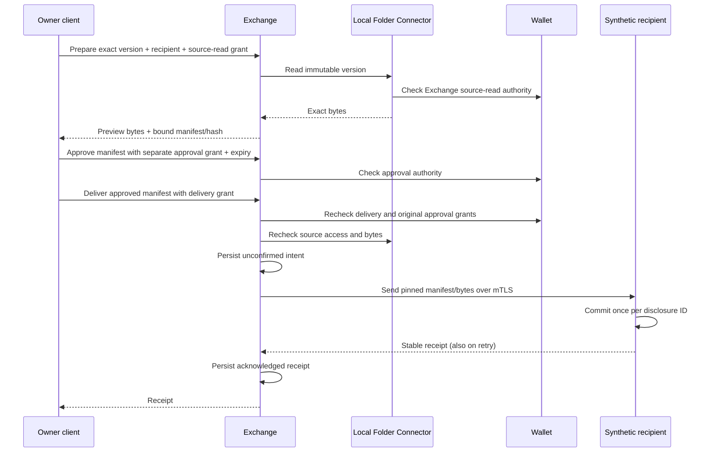

# UC-006 — Controlled disclosure of one exact document

Status: implemented synthetic macOS slice; verification evidence is recorded below. Actor: the owner of one synthetic document. Outcome: inspect exact bytes and recipient, approve their immutable manifest, deliver and recover a durable receipt after interruption.

## Scope and flow

Three Farmy module instances plus one recipient fixture; minimal Registry composition. Source/content uses one Wallet namespace. Fixed `synthetic.review` purpose, 16 KiB limit, one configured recipient. No changes to Processing, Knowledge, Workflow, Model access or Assistance are required.

## Acceptance evidence

- Exact preview bytes match the immutable source version and accepted recipient bytes.
- Missing approval or separate export authority, wrong actors, unenrolled identities, changed recipient/certificate/content/version/purpose and expired approval are rejected.
- Revoking source-read, approval or delivery grants blocks subsequent attempts; unavailable authority/source fails closed.
- Outage leaves a durable unconfirmed delivery; retry after restart recovers without a second accepted copy.
- A recipient that commits then loses its acknowledgement returns the original receipt after both processes restart. Concurrent retries also converge.
- Later source versions do not alter approved bytes. Recipient verifies sender, manifest and content.
- Read-only monitoring reports counts/activity through public APIs; it has no export permissions.

Verification commands: [run instructions](../uc006/README.md). Fourteen UC-006 acceptance checks plus the earlier suites; 80 total checks and six demonstrations when local Qwen is available. Actual run on 2026-09-21: all 80 checks and six demos passed on macOS 26.6.2 arm64 / Python 3.14.6, including installed Qwen through Ollama. Browser inspection confirmed the three-node live inventory, Exchange counts/activity and UC-006 project walkthrough. Implementation revision: [`403577c`](https://github.com/cgrbxl/farmy/commit/403577c).

## Expected versus actual module changes

Expected: new Exchange runtime and disclosure contract, recipient fixture, composition, acceptance checks and dashboard evidence. Actual: those changes plus a small shared transport operation-dispatch registration, and generalisation of the existing monitor's hardcoded inventory diagram/status labels so it can show the smaller Exchange composition. Wallet and Connector source and database schemas remain unchanged; their existing grants and read APIs suffice. Existing monitor permissions remain read-only.

Exchange starts with a new private SQLite schema; no previous Exchange data is migrated. Earlier module stores are unchanged. New semantics use contract `0.6-draft`, Exchange implementation `0.1.0` and the existing development security profile. No release package or migration path for arbitrary providers is claimed.

## Limits and next learning

A persisted receipt means recipient storage acceptance, not human review or downstream control. An ambiguous send may already have disclosed bytes; expiry/revocation can then block automatic retry, requiring reconciliation. This profile relies on a recipient deduplication contract and does not blindly retry arbitrary delivery protocols. Credential signing and browser write interactions remain in the future backlog.

Next queued outcome: add a real S3 source while retaining these disclosure and earlier path checks. Actual provider access and its bounded test scope must be available before claiming compatibility.
