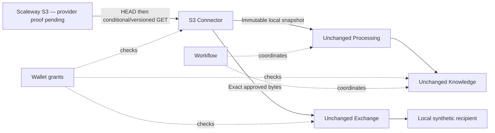

# UC-007 — A second storage implementation

Status: **in progress; real-provider validation awaiting approved bucket/region/prefix and scoped credential reference**. The actor is an owner importing a synthetic report from Scaleway Object Storage. The desired result is the existing exact-version evidence and approved export path working with a new source implementation, without unrelated module changes.

## Acceptance and evidence

Eleven local checks cover explicit endpoint/credential configuration, no ambient credential fallback, fixture credential isolation, unchanged processing/disclosure APIs, version-pinned capture during overwrite, conditional conflict without versioning, key confinement, provider errors, size/truncation limits, retained versions/restart/revocation and private monitoring summaries. Real SDK HTTP requests reach the local double; this proves no Scaleway semantics by itself.

The earlier six slices remain regression evidence. Complete the real-provider run, controlled denied access and applicable version/conditional behaviour before promoting UC-007 to done. Record unsupported cases explicitly rather than presenting the double as compatibility evidence. The [run instructions](../uc007/README.md) specify the missing provider input and safe reproduction commands.

## Change locality

Expected: S3 acquisition implementation, optional SDK dependency, fresh composition and tests. Actual: those changes plus extraction of the existing snapshot persistence/read enforcement into an optional helper shared with Local Folder. Local Folder's safe reader and database layout are unchanged. Wallet, Registry, Processing, Knowledge, Workflow and Exchange source/contracts are unchanged. No new envelope or operation version is needed: the existing storage operations already capture/read opaque bytes.

The fixed `connector.local` role remains a limitation. This adds a second storage implementation to choose in a fresh solution; it does not demonstrate two source connector instances in one Wallet. Provider version/ETag are used during acquisition; public references remain Farmy immutable versions and content digests.

Local snapshots survive provider changes/outages, but consumers must still pass current Wallet permission checks. Provider credential revocation does not delete local copies. The S3 implementation never changes objects, bucket settings or IAM. New provider tests that write fixtures require a concrete scoped plan.

## Next action

Finish real Scaleway evidence when the maintainer identifies the approved test location and credential reference. Keep the dashboard at six completed slices until that condition is met; do not advance the delivery queue to provider replacement yet.

## Recorded local verification

On 2026-09-21, macOS 26.6.2 arm64 / Python 3.14.6: the combined runner with `--with-local-model --with-s3-fixture` passed all 91 checks and seven demos, including the installed local Qwen run. Browser inspection confirmed six monitored Farmy instances and the S3 Source (fixture) snapshot counts. Real Scaleway validation was not performed; no cloud resources were accessed or changed.
